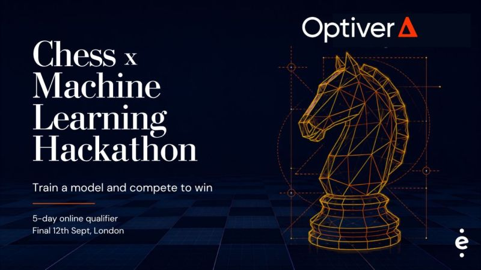

<p align="center">
  
</p>

<h1 align="center">ChessML</h1>

<p align="center">
  <b>A chess engine in pure Python that plays at a speed Python is not supposed to reach.</b><br>
  <sub>Built for the Optiver Chess × Machine Learning Hackathon (AI Chessathon 2026)</sub>
</p>

<p align="center">
  
  
  
  
  
</p>

---

## At a glance

|  |  |
|---|---|
| **What** | Bitboard chess engine, entire hot path compiled by [numba](https://numba.pydata.org/) |
| **Size** | ~3,100 lines of engine · 166 KB submission · 100% Python source |
| **Learned** | 1,156 evaluation weights fitted to 4M Stockfish-annotated positions |
| **Correctness** | All 6 published `perft` positions exact, over 446M nodes |
| **Speed** | ~85M nodes/s move generation · ready in 28s of a 90s budget |
| **Tactics** | 75.7% of 600 Lichess puzzles at a fixed 20,000 nodes |

The constraints were the interesting part: **one CPU core, 2 GB RAM, no network, no GPU,
no native binaries** (the submission must be source a judge can read), and no third-party
chess engine anywhere inside it. 120 seconds + 0.5 s per move.

---

## What it is

The whole submission is one function:

```python
def get_move(fen: str, time_left_ms: int) -> str:
    ...  # returns "e2e4", or "e7e8q" for a promotion
```

Under it sits a conventional-looking but **fully compiled** engine: magic-bitboard move
generation, alpha-beta with a transposition table and the modern family of reductions and
prunings, and a tapered evaluation whose 1,156 weights were machine-fitted.

`python-chess` is used for exactly two things — parsing the incoming FEN, and
double-checking the move we return is legal. Everything between is our own compiled code.

---

## Results

| Change | Elo | Measured over |
|---|---:|---|
| Evaluation fitted to own self-play games | **+203** | 200 games |
| Evaluation refitted to Lichess/Stockfish evals | **+241** | 120 games @ 20k nodes |
| Search pruning-margin profile | **+29** | 48 paired games, held-out openings |

Every number above comes from a **fixed-node match against the previous version**, never
from a fitting score. Tactics by puzzle rating band:

| Rating band | 0–1200 | 1200–1600 | 1600–2000 | 2000–2400 | 2400+ |
|---|---:|---:|---:|---:|---:|
| **Solved** | 93.3% | 78.0% | 59.5% | 54.2% | 46.7% |

Final standing on the rated ladder: **6.5 / 13** — mid-field. Technically clean across all
13 rated games: no flags, no crashes, no illegal moves. Honest assessment of why it wasn't
better is in [Limitations](#limitations).

---

## The idea that makes it work

The starter kit's guidance is blunt:

> *"You are on one core in Python, so node counts are small: expect thousands, not
> millions. Depth is expensive, so evaluation quality and ordering buy more than they
> would in a C engine."*

True of a `python-chess` search. **Not true of numba.** The reference baseline shipped with
the competition JITs only its *evaluation* and is, in the organisers' own words, "barely
stronger" for it — which is the real lesson hiding in that note:

> **JITting a component wins nothing. JITting the loop wins the game.**

So the bet was to compile all of it — board, move generation, make/unmake, evaluation,
search — and accept the one cost that follows: numba has to compile the entire engine
before the first move. Much of the engineering below is paying that bill.

---

## How it's built

| File | Lines | What it is |
|---|---:|---|
| `agent.py` | 333 | Clock, repetition history, staged warm-up, interim search |
| `nx_core.py` | 975 | Bitboards, attack tables, legal move generation, make/unmake, SEE |
| `nx_eval.py` | 462 | Tapered evaluation, split into small functions *for compile time* |
| `nx_params.py` | 329 | All 1,156 evaluation weights as one flat, tunable vector |
| `nx_search.py` | 732 | Alpha-beta, one depth per call |
| `nx_fallback.py` | 126 | Pure-Python search — last resort if nothing has compiled yet |
| `nx_magic.py` | 105 | Magic multipliers, generated offline by `scripts/genmagic.py` |

```
get_move(fen, time_left_ms)
  ├─ parse FEN, load into bitboards
  ├─ update repetition history   (we're told positions, never moves)
  ├─ compute soft + hard time limits
  ├─ start watchdog thread → sets a stop flag
  └─ iterative deepening, one depth per compiled call
       └─ aspiration → search_root → negamax → qsearch → evaluate
```

**Nothing ships as borrowed data.** Magic multipliers come from our own search; Zobrist
keys are generated at start-up from a seeded xorshift. No opening book, no tablebases.

<details>
<summary><b>Inside the search</b> — the full feature list</summary>

<br>

Iterative deepening with aspiration windows, driven **from Python one depth at a time** so
time management and best-move stability stay in readable code while every node below runs
compiled.

Principal variation search · lockless transposition table (key XOR payload, so a torn
entry simply fails to match) · null-move pruning · late move reductions · late move
pruning · futility and reverse futility · razoring · SEE pruning · check extensions ·
internal iterative reduction · killers, butterfly history, counter moves and two plies of
continuation history · quiescence with static-exchange and delta pruning.

**Move generation is fully legal, not pseudo-legal.** King moves are tested with the king
lifted off the board so sliders x-ray through the square it leaves; other moves are
filtered through a pin mask; in check, the target set is restricted to blocks and captures
of the checker. Nothing in the search ever makes a move to find out it was illegal.

</details>

<details>
<summary><b>The clock</b> — how a compiled search gets interrupted</summary>

<br>

**No compiled function ever reads a clock.** Search functions are compiled with
`nogil=True`, so a watchdog thread sets a stop flag in a shared numpy array and the search
picks it up within a few thousand nodes. Zero timing code on the hot path.

The same property pays off twice: because the search releases the GIL, the offline weight
tuner runs it across all eight cores of a development machine — where, unlike in a rated
game, there is more than one.

Flagging loses a game outright, so the hard limit is always a *fraction of the clock
remaining* rather than a multiple of the soft limit. Between iterations Python decides
whether to start another, predictively: each iteration costs well over the last, so
finishing inside the budget means not starting one that cannot fit.

</details>

---

## The machine learning part

The evaluation is a tapered feature model — material, piece-square tables, mobility, pawn
structure with passed pawns, king shelter and an attack-unit king-danger term, piece terms,
threats, endgame scaling. Every weight lives in **one flat vector**, which is the design
decision that makes the rest possible: it keeps the evaluation a pure function of
`(position, weights)`, so a tuner can fit the whole thing without the evaluation knowing a
tuner exists.

Starting values are **built, not tabulated** — piece-square tables come from shape
functions over centrality, advancement and file preference, so the starting point is
explainable rather than copied from another engine. Then they're fitted:

```bash
# 1. stream 4M Stockfish-annotated positions from the Lichess open database (~18 min)
python scripts/fetch_evals.py --positions 4000000

# 2. fit 1,156 weights by coordinate descent with a line search, 8 threads
python scripts/tune.py --data "data/ev*.npz" --k 0.5 --from-default --sweeps 8 --no-write

# 3. only a match decides whether it is actually better
python scripts/arena.py --a data/tuned.npy --games 200 --nodes 20000
```

`fetch_evals.py` keeps only positions that are **not in check** and where the engine's own
best move is **quiet** — because a *static* evaluation should be fitted where a static
evaluation is the right tool. If the best move wins material, the score describes a tactic,
not a position.

Held-out error over 8 sweeps on 630,000 positions: **0.0518 → 0.0264**, and still falling
when the run stopped — which is the most useful thing the tuning revealed.

> **On the name:** the "ML" here is supervised fitting of an interpretable weight vector,
> not a neural network. A 64-wide incremental king-bucket NNUE *was* prototyped — integer
> inference hit 5.88M evaluations/s and all 100 randomised accumulator updates matched full
> refreshes — but the 300k-position model solved only 65/100 puzzles and pushed the compile
> past the 90-second budget. It was **rejected**; its code and weights are deliberately not
> in the submission.

### Using Stockfish-labelled data

The competition bans third-party engines and permits engine-annotated training data, in two
separate places:

> "Training data is unrestricted, including positions annotated by an existing engine. The
> ban covers only what ships inside the submission."

So: **no engine source is copied, vendored, linked or executed anywhere.** Nothing from the
Lichess database ships. What the data did was choose the numbers in `nx_params.py`, and
`scripts/fetch_evals.py` — the exact code that built the training set — ships inside the
submission so provenance can be checked rather than taken on trust.

---

## Engineering notes

The three things that cost the most time, and what they taught.

<details>
<summary><b>1. numba compiles a second copy of a function for every literal you pass it</b></summary>

<br>

Start-up began at **119 seconds** against what was then believed to be a 60-second budget.
Neither the optimisation level nor the LLVM flags moved it much — which was the clue: the
cost was in numba's own front end, not LLVM. Dumping the compiled signatures showed the
move generator had been compiled **five times**, and the search several.

Passing a Python literal such as `0` or `False` to a jitted function makes numba type it as
`Literal[int]` and build an entire extra specialisation. Routing every scalar through a
typed constant collapsed the duplicates.

The same trap in a different coat cost another **12 seconds** later: calling a jitted
function from Python with a plain `int` where the search passes an `int32` out of an array
is a second type, and gets a second copy.

Two smaller wins followed. Compile time grows far faster than linearly with the size of a
single function, so the evaluation and move generator are deliberately split into small
ones. And `error_model="numpy"` drops the divide-by-zero check numba wraps around every
integer division — this code divides constantly, so it cut compile time *and* lifted perft
from 66 to 81M nodes/s. Every divisor here is a non-zero constant.

**Result: 67 s → 27.7 s**, pinned to one core. `tools/compileprofile.py` exists to print
per-function compile cost and duplicate specialisations, because this will happen again.

</details>

<details>
<summary><b>2. An evaluation that fit the data better and played worse</b></summary>

<br>

Refitting to the Stockfish-labelled positions **halved** the held-out error. It then lost
the match by 16 Elo.

The fit was fine; the *magnitude* was not. The tuner had put a pawn at about 52 instead of
100 — and the search's pruning margins are **fixed centipawn constants** (reverse futility
at 66 per ply, razoring at 180, delta pruning at 140, plus the SEE piece values). Halving
the evaluation silently doubled every one of those in evaluation terms, making the search
prune far too aggressively.

Multiplying the whole vector by two — same shape, same relative weights, nothing refitted —
turned −16 into **+241**.

| Eval scale | ×1.0 | ×1.4 | ×1.7 | **×2.0** | ×2.3 | ×2.6 | ×3.0 |
|---|---:|---:|---:|---:|---:|---:|---:|
| Score vs previous | 47.8% | 72.5% | 79.0% | **80.0%** | 83.5% | 84.0% | 83.5% |

×2.0 shipped rather than the nominal peak: it puts a pawn at 104, the same scale the SEE
values and pruning margins already assume, and a head-to-head at 20k nodes could not
separate it from ×2.6.

**The evaluation and the search are not independent, even though they look it.** Tuning
with `--k 0.5` now lands on that scale directly.

</details>

<details>
<summary><b>3. Optimising a problem that did not exist</b></summary>

<br>

Pinned to one core, warm-up took 67 s against a documented 60 s budget, so the conclusion
looked obvious: the agent was opening every rated game with its ~1800-strength Python
fallback. A long stretch went into fixing that.

Then the match logs arrived:

```
INIT
  Ready in       28.1 s
  Budget         90.0 s
  Used           31 percent
```

The real budget was **90 seconds, not the 60 in the documentation**, and the judge machine
was faster than the development laptop's single core. Compilation had never been the
problem.

The compile work was worth keeping — a 2.4× faster start and a 23% faster engine — but it
fixed nothing that was losing games. **Read the logs before theorising.**

</details>

---

## Testing

The harness is a real part of the project, because in engine work almost every plausible
idea is worth zero or negative Elo and the only way to know is to measure.

| Tool | What it answers |
|---|---|
| `scripts/perft.py` | Is the move generator *exactly* right? 6 positions, 446M nodes |
| `scripts/puzzles.py` | Did a change make it see more or less? 600 puzzles, ~30 s |
| `scripts/arena.py` | Does the new version actually beat the old? Fixed **node** counts |
| `scripts/sanity.py` | Does the evaluation agree with chess basics? |
| `tools/clocktest.py` | Does a full 120 s + 0.5 s game finish without flagging? |
| `tools/initprobe.py` | Does start-up fit, pinned to one core like the platform? |
| `tools/compileprofile.py` | Where is compile time going? Any duplicate signatures? |
| `tools/match.py` | Does it survive the platform's own referee, unmodified? |

Two deliberate choices: the **arena is node-limited, not time-limited**, so a result means
the same thing on a throttled laptop as on a server and CPU contention cannot bias it. And
the **puzzle suite is the fast signal** — 30 seconds, and it says *why* something changed
in a way a match score never can, so it runs first and the arena confirms.

**Ideas measured and rejected**, which is the point of having the harness:

- **Contempt** (scoring draws as slightly bad, to avoid repetition draws) — looked obviously
  right after a game was drawn in 11 moves by rook shuffling. Measured at 16, 28 and 45 over
  150 games each: −26, −2, −33 Elo. Ships at zero.
- **The NNUE candidate** — fast and numerically verified, but weaker and too slow to compile.
- **`no_cpython_wrapper=True`** — a real compile saving that **segfaults** rather than raising
  if the function is ever called from Python. Not worth it.

---

## Quick start

```bash
pip install "chess==1.11.2" numpy numba     # the platform's exact versions

python scripts/perft.py                      # correctness — must report 0 failures
python scripts/puzzles.py --fetch 40000      # once: cache the puzzle set
python scripts/puzzles.py --count 1000       # tactics by rating band
python tools/clocktest.py                    # a full game under the real clock
python tools/match.py --black baselines/minimax --games 4 --base-ms 20000

python -m harness.package --include scripts  # build the submission zip
```

`scripts/` is deliberately included in the zip so a judge reading the submission can see
where the magic numbers and tuned weights came from.

`harness/` is the platform's own referee and wire protocol, carried **unmodified** — editing
it would make local results meaningless. `tools/` is local-only and is not shipped.

---

## Limitations

**The evaluation is the ceiling.** The held-out fitting error was still falling when the last
run stopped, and had already halved. That says the *handcrafted functional form*, not the
data, is the limit — and there are 390 million more labelled positions where the four million
came from. A trained network is the next real gain, and it would *reduce* compile time rather
than add to it.

**It has no plan in quiet positions.** One rated game was drawn in 11 moves after the engine
played `Rb1 Ra1 Rb1 Ra1 Rb1 Ra1`. The evaluation is flat when nothing is forcing, so every
move looks the same and it shuffles. Same problem as above, wearing a different hat.

**Only one search-parameter family was tuned.** The accepted futility/razoring/SEE profile
gained 29 Elo; LMR and null-move parameters still use hand-chosen values. There is no pruning
at PV nodes at all, which is conservative.

**One unexplained event.** A single clock test flagged at ply 44 and never reproduced in four
later runs — probably a machine stall under load. `agent.py` now prints `OVERSHOOT` to stderr
if a move ever exceeds its hard limit, so if it recurs there is a trail.

[`HANDOVER.md`](HANDOVER.md) has the full state and the ranked next steps.

---

## Licence and attribution

The engine (`agent.py`, `nx_*.py`, `scripts/`, `tools/`) is **MIT licensed** — see
[LICENSE](LICENSE).

`harness/` and `baselines/` are third-party code from the competition starter kit, MIT
© 2026 Advit Arora. Training data came from the Lichess open database under CC0. Full
attribution in [NOTICE.md](NOTICE.md).

<sub>The banner is the event's own promotional artwork, © Optiver / AI Chessathon, included
here to identify the competition this was built for. No affiliation or endorsement is
implied.</sub>
